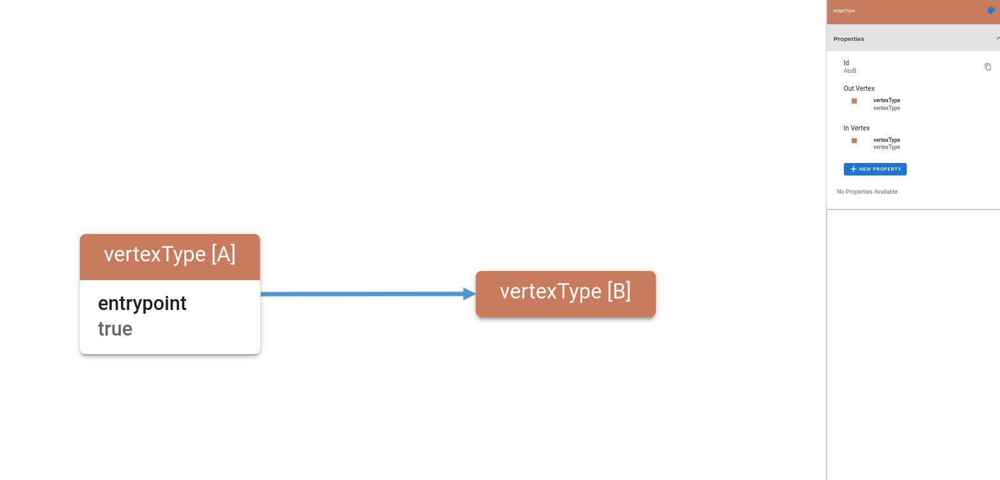
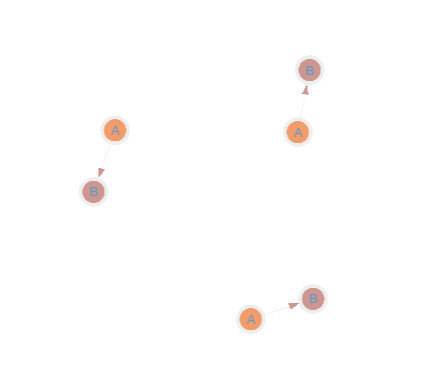
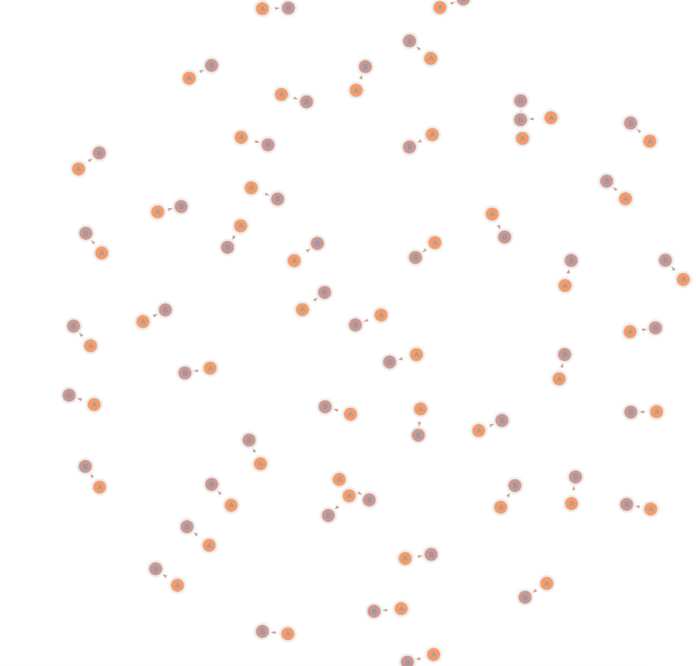

A schema graph, or meta graph, is a graph that captures and encodes the structure, properties, 
types and ranges of values of another graph.

A schema graph is very similar to a UML diagram.
The DDL for the Schema Graph is the Gremlin language.

Lets start with the simplest schema: 

(Vertex A) -(Edge E)-> (Vertex B)

In YAML format, this looks like:
```yaml
rootVertexTypes:
  - name: A
    likelihood: 1.0
    chancesToCreate: 1

vertexTypes:

  - name: A
    outEdges:
      - name: AtoB
        likelihood: 1.0
        chancesToCreate: 1
    properties: []

  - name: B
    outEdges: []
    properties: []

edgeTypes:
  - name: AtoB
    inVertex: B
    outVertex: A
    properties: []
```
Now, lets see what the schema graph diagram looks like:


How would we define this in gremlin?
```groovy
g.addV('vertexType')
  .as('A')
  .property(single, 'entrypoint', true)
  .addV('vertexType')
  .as('B')
  .addE('edgeType').from('A').to('B')
```
Pretty straightforward.

Lets start from an empty Graph, define a schema, then generate some data.

Open an empty Graph in Gremlin Console, and define the schema, then write it to a file. \
In this example, we will put it in `/tmp/schema.json`. Your system may have a different temp directory. 

```groovy
gremlin> graph = TinkerGraph.open()
==>tinkergraph[vertices:0 edges:0]
gremlin> g = graph.traversal()
==>graphtraversalsource[tinkergraph[vertices:0 edges:0], standard]
gremlin> g.addV('vertexType').as('A').property(single,'entrypoint',true).addV('vertexType').as('B').addE('edgeType').from('A').to('B')
==>e[3][0-edgeType->2]
gremlin> g.io("/tmp/schema.json").write().iterate();
```

Now lets use our new schema.  For `Direct Write` You need to have gremlin server setup and listening. \
In this example, it is setup and listening on `localhost:8182`. \
It is also possiable to write to CSV files.
```shell
java -cp core/target/core-1.0.0-SNAPSHOT.jar:extensions/tinkerpop/target/tinkerpop-1.0.0-SNAPSHOT.jar:cli/target/cli-1.0.0-SNAPSHOT.jar \
  com.aerospike.movement.cli.CLI \
  task=Generate \
  -d \
  -c conf/generator/generateToGremlinServer.properties \
  -s generator.schema.graphschema.graphson.file=conf/generator/simplest_schema.json \
  -s traversalSource.host=localhost \
  -s traversalSource.port=8182 \
  -s generator.scaleFactor=3

...
Processed 300 elements in 1.332000 seconds (225.225225 elements per second)
```

Now, if you connect to your Gremlin server with a visualization tool, you can see we have created 3 minimum A->B 
graph islands.



you can change generator.scaleFactor, for example, 100:




